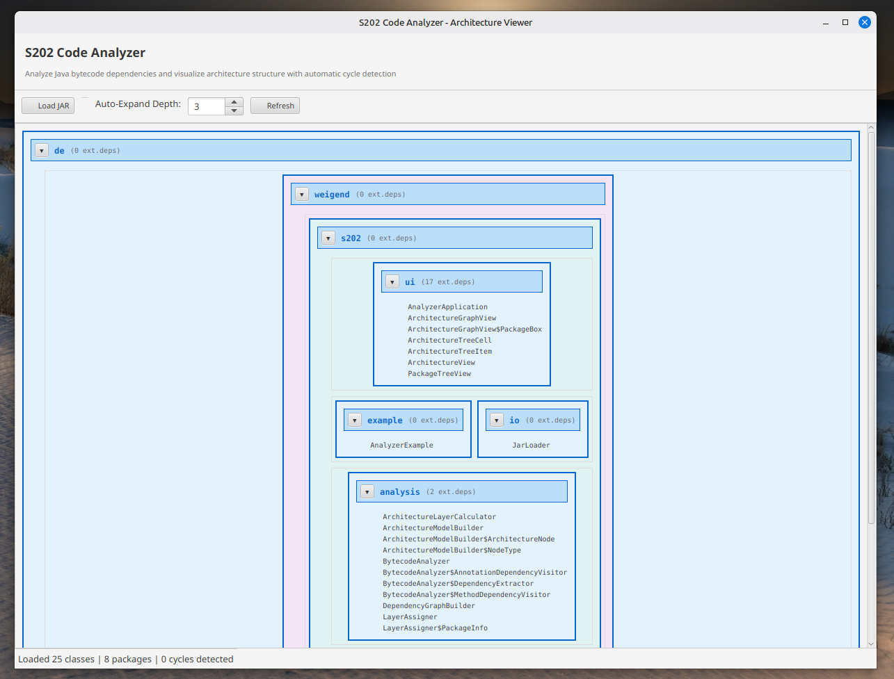

# S202 Code Analyzer

Ein JavaFX-basiertes Tool zur Analyse von Java-Bytecode und Visualisierung der Architektur mit Abhängigkeitserkennung.



## Features

- **Bytecode-Analyse**: Parst Java .class-Dateien mit ASM 9.6
- **Abhängigkeitserkennung**: Extrahiert Klassen- und Paket-Abhängigkeiten
- **Zyklische Abhängigkeiten**: Automatische Erkennung und Aggregation von Zyklen
- **Architektur-Layering**: Topologische Sortierung - Pakete nach Abhängigkeitstiefe angeordnet
- **Hierarchische Visualisierung**: Aufklappbare Pakete und Klassen mit JavaFX TreeView
- **Parent Package Wrapping**: Vollständige Paket-Hierarchie (z.B. de → weigend → s202)
- **Horizontal Layer Layout**: Pakete der gleichen Schicht nebeneinander angeordnet
- **Auto-Expand**: Konfigurierbare Tiefe für automatisches Aufklappen (1-10 Ebenen, Default: 3)

## Projektstruktur

```
src/
├── main/
│   ├── java/de/weigend/s202/
│   │   ├── model/               # Datenmodelle (UI-frei)
│   │   │   ├── ClassDependency.java
│   │   │   ├── JavaClass.java
│   │   │   ├── JavaPackage.java
│   │   │   └── CyclicDependency.java
│   │   ├── io/                  # JAR-Handling
│   │   │   ├── JarLoader.java
│   │   │   └── BytecodeAnalyzer.java
│   │   ├── analysis/            # Analyse-Logik (UI-frei)
│   │   │   ├── DependencyGraphBuilder.java
│   │   │   ├── ArchitectureModelBuilder.java
│   │   │   └── LayerAssigner.java
│   │   ├── ui/                  # JavaFX UI
│   │   │   ├── AnalyzerApplication.java
│   │   │   ├── ArchitectureView.java
│   │   │   ├── PackageTreeView.java
│   │   │   ├── ArchitectureTreeCell.java
│   │   │   └── ArchitectureGraphView.java
│   │   └── example/             # Beispiel-Code
│   │       └── AnalyzerExample.java
│   └── resources/
└── test/
    └── java/de/weigend/s202/
        ├── model/               # Unit Tests für Modelle
        └── analysis/            # Unit Tests für Analyse (35 Tests)
```

## Dependencies

- **JavaFX 21.0.1**: UI-Framework
- **ASM 9.6**: Bytecode-Analyse
- **JUnit 5**: Unit Testing
- **Java 17+**: Minimum JDK Version

## Build & Run

### Build
```bash
mvn clean install
```

### Tests ausführen
```bash
mvn test
```

### Anwendung starten (Variante 1: Mit Maven)
```bash
mvn javafx:run
```

### Anwendung starten (Variante 2: JAR-Datei)
```bash
java -jar target/s202-code-analyzer-1.0.0.jar
```

### In VS Code starten
1. Öffne die Kommandopalette: `Ctrl+Shift+P`
2. Wähle "Maven: Run from Terminal" oder
3. Drücke `F5` (mit launch.json Konfiguration)
4. Weitere Details siehe [VS_CODE_SETUP.md](VS_CODE_SETUP.md)

## Architektur

### Trennung der Schichten

#### 1. **Model Layer** (`de.weigend.s202.model`)
- Reine Datenklassen
- Keine Abhängigkeiten zu UI oder ASM
- Vollständig mit Unit Tests abgesichert

#### 2. **IO Layer** (`de.weigend.s202.io`)
- `JarLoader`: Laden und Verarbeitung von JAR-Dateien
- `BytecodeAnalyzer`: Konvertiert .class → JavaClass Modelle mit ASM

#### 3. **Analysis Layer** (`de.weigend.s202.analysis`)
- `DependencyGraphBuilder`: Konstruiert Abhängigkeitsgraph aus JavaClasses
- `LayerAssigner`: Berechnet architektonische Layer via topologische Sortierung
- `ArchitectureModelBuilder`: Erstellt UI-Datenmodell mit Parent-Wrapping und Layer-Zuordnung

#### 4. **UI Layer** (`de.weigend.s202.ui`)
- `AnalyzerApplication`: Entry Point und JAR-Lade-Controller
- `ArchitectureView`: Hauptkomponente mit UI-Koordination
- `PackageTreeView`: TreeView mit hierarchischem Layout und horizontaler Layer-Anordnung
- `ArchitectureTreeCell`: Custom TreeCell für Styling und Toggle-Buttons
- `ArchitectureGraphView`: Alternative Graphen-Visualisierung (optional)

### Datenfluss

```
.class Dateien (aus JAR)
     ↓
JarLoader → BytecodeAnalyzer (ASM 9.6)
     ↓
JavaClass + ClassDependency (Modelle)
     ↓
DependencyGraphBuilder
     ↓
JavaPackage Hierarchie + Zyklen-Erkennung
     ↓
LayerAssigner (topologische Sortierung)
     ↓
ArchitectureModelBuilder (mit Parent-Wrapping)
     ↓
ArchitectureNode Baum (Fachmodell für UI)
     ↓
PackageTreeView (JavaFX mit horizontaler Layer-Anordnung)
```

## Verwendung

### Basis-Beispiel

```java
// 1. Bytecode analysieren
BytecodeAnalyzer analyzer = new BytecodeAnalyzer();
JavaClass myClass = analyzer.analyzeClass(
    "com.example.MyClass",
    new FileInputStream("MyClass.class")
);

// 2. Graph konstruieren
DependencyGraphBuilder builder = new DependencyGraphBuilder();
builder.addClass(myClass);
JavaPackage root = builder.buildPackageHierarchy("com");

// 3. UI-Modell erstellen
ArchitectureModelBuilder uiBuilder = new ArchitectureModelBuilder();
ArchitectureNode model = uiBuilder.buildModel(root, 3); // 3 Ebenen auto-expand

// 4. In UI anzeigen
architectureView.setArchitectureRoot(model);
```

## Verwendung

### Basis-Beispiel

```java
// 1. Bytecode analysieren
BytecodeAnalyzer analyzer = new BytecodeAnalyzer();
JavaClass myClass = analyzer.analyzeClass(
    "com.example.MyClass",
    new FileInputStream("MyClass.class")
);

// 2. Graph konstruieren
DependencyGraphBuilder builder = new DependencyGraphBuilder();
builder.addClass(myClass);
JavaPackage root = builder.buildPackageHierarchy("com");

// 3. UI-Modell erstellen
ArchitectureModelBuilder uiBuilder = new ArchitectureModelBuilder();
ArchitectureNode model = uiBuilder.buildModel(root, 3); // 3 Ebenen auto-expand

// 4. In UI anzeigen
architectureView.setArchitectureRoot(model);
```

## UI Features

### File Loader
- **📂 Load JAR Button**: Öffnet File-Dialog zur Auswahl von JAR-Dateien
- **Automatische Analyse**: Extrahiert alle .class-Dateien und analysiert Abhängigkeiten
- **Zyklus-Erkennung**: Zeigt Anzahl der erkannten Zyklen
- **Fehlerbehandlung**: Informiert Benutzer über Analysen-Fehler

### Auto-Expand Controls
- **Spinner**: Einstellbar von 1-10 Ebenen (Default: 3)
- **Hierarchisches Laden**: Automatisches Expandieren basierend auf Tiefe-Einstellung
- **Status Bar**: Zeigt Anzahl Klassen, Pakete und erkannte Zyklen

### Hierarchische Baumansicht mit Layer-Layout
- **Horizontal sortiert**: Pakete der gleichen Architektur-Schicht stehen nebeneinander
- **Parent-Wrapping**: Vollständige Paket-Hierarchie angezeigt (z.B. de → weigend → s202)
- **Layer-Berechnung**: Automatische Sortierung nach Abhängigkeitstiefe
- **📦 Pakete**: Fett, blau, mit Toggle-Button
- **📄 Klassen**: Regulär, schwarz, ohne Expander
- **Aufklapp-Symbole**: Kompakte 20x20 Buttons für Pakete mit Kindern

## Testing

Das Projekt hat umfassende Unit Tests für alle Kernkomponenten:

- **JavaClassTest**: 9 Tests
- **JavaPackageTest**: 10 Tests
- **DependencyGraphBuilderTest**: 7 Tests
- **ArchitectureModelBuilderTest**: 9 Tests

**Gesamt: 35 Tests mit 100% Erfolgsquote**

Alle Tests verwenden JUnit 5 mit Assertions für:
- Korrekte Objekt-Erstellung
- Validierung von Eingaben
- Gleichheit und Hash-Codes
- Hierarchie-Konstruktion

## Performance

- **ASM**: ~1ms pro Klasse für Bytecode-Analyse
- **GraphBuilder**: O(n) für n Klassen
- **UI Rendering**: Optimiert für 1000+ Pakete mit lazy loading

## VS Code Integration

Für vollständige VS Code Setup-Anleitung siehe [VS_CODE_SETUP.md](VS_CODE_SETUP.md)

Quick Start:
```bash
cd /home/johannes/Programieren/Structure202
code .
# Drücke Ctrl+Shift+P und wähle "Maven: Run from Terminal"
# Oder: mvn javafx:run
```

## Erweiterungsmöglichkeiten (TODO)

1. **Dependency Graph Visualization**: Visuelle Pfeile zwischen Paketen/Klassen
2. **Cycle Highlighting**: Farbliche Hervorhebung von Zyklen
3. **Advanced Filtering**: Nach Package-Namen, Layer, Abhängigkeitstyp
4. **Export**: SVG, PDF, PlantUML, Graphviz DOT
5. **Search & Find**: Text-Suche nach Packages/Klassen
6. **Statistics Dashboard**: Metriken (Kohäsion, Kopplung, etc.)
7. **Context Menu**: Rechtsklick-Optionen (Copy, Expand All, etc.)
8. **Logging Framework**: SLF4J statt System.out
