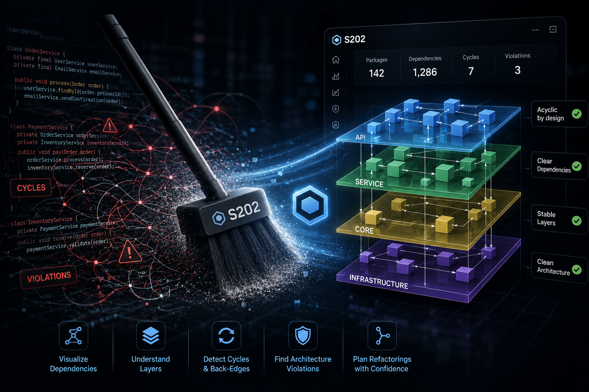
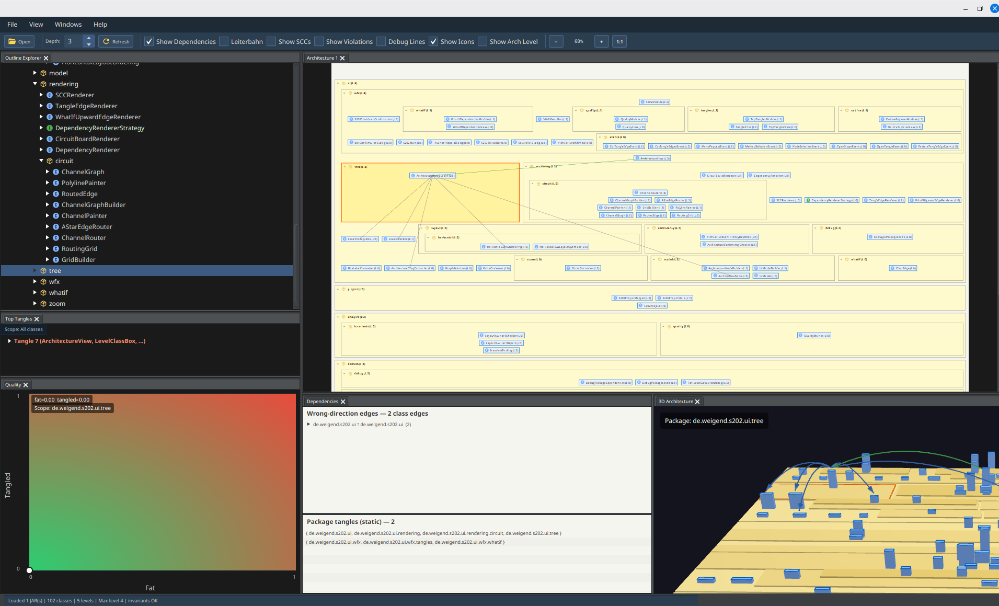
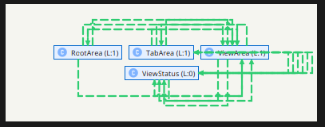
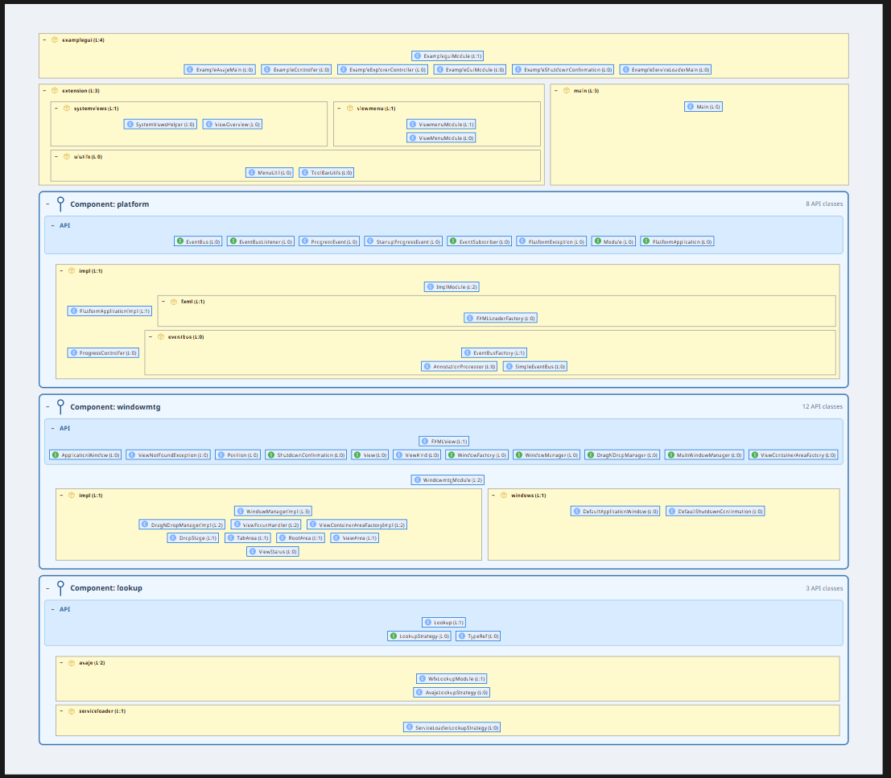

# S202 Code Analyzer

A JavaFX-based tool for analyzing Java bytecode and Python source code and visualizing code architecture.

> **→ [The Tool That Fixed Itself — S202 Case Study](docs/s202/CASE_STUDY.md)**
> *We pointed S202 at its own codebase. No source code was read. Here's what happened.*




## Features

- **Bytecode analysis**: Parses Java `.class` files with ASM 9.6
- **Python source analysis**: Analyzes Python source trees via CPython's `ast` module; maps modules to the same dependency model as Java (no extra tooling beyond a standard `python3` install)
- **Dependency detection**: Extracts class/module and package dependencies (imports, calls, inheritance, type annotations)
- **Cycle detection**: Detects two independent kinds of cycles — **class cycles** (red overlay: SCCs at the class level) and **package cycles** (orange overlay: tangles at the package level); both are separately togglable because they answer different questions
- **Architecture layering**: Topological ordering by dependency depth
- **Hierarchical visualization**: JavaFX TreeView with expandable packages
- **Component View**: Shows top-level components with an explicit API area above the implementation packages
- **Violation detection**: Marks architectural violations (backward dependencies)
- **Component policy checks**: Detects calls into another component's implementation and API classes depending on implementation classes
- **Multi-project import**: Load Maven (`pom.xml`) and Gradle (`settings.gradle`) multi-module projects directly; all module JARs are collected automatically
- **Layout invariant check**: Five machine-checkable invariants act as plausibility alerts for developers; four of them (R1/R2/R3/R5) never fire on a correct pipeline and report algorithm bugs with a copyable reproducer block, while R1-visual fires only on remaining edges of broken cycles and shows real architectural violations

## Quick Start

**First time setup** — WFX (the UI platform dependency) is not on Maven Central.
Run the bootstrap script once; it clones WFX, builds it, then builds S202:

**Linux / macOS**
```bash
chmod +x build-all.sh && ./build-all.sh
# then start with:
./run-ui.sh
# or pass a JAR directly:
./run-ui.sh path/to/your.jar
```

**Windows** (cmd or double-click)
```
build-all.bat
rem then start with:
run-ui.bat
```

After the initial bootstrap, the standard Maven commands also work:
```bash
mvn clean install        # build
mvn javafx:run -pl analyzer  # start
mvn test                 # tests
```

Then use the **File** menu:

- **Open JAR…** - one or more JARs (multi-selection opens a staging dialog)
- **Open Maven Project…** - select the root `pom.xml`; all module JARs from `target/` are collected
- **Open Gradle Project…** - select `settings.gradle(.kts)` or `build.gradle(.kts)`; all module JARs from `build/libs/` are collected
- **Open Python Source…** - select a Python project root or package directory; requires `python3` in PATH (or set the `PYTHON` environment variable)

The architecture is analyzed, visualized, and automatically checked against five layout invariants (plausibility alerts).

## Layered Architecture View

The **Layered Architecture View** is the default view after loading a JAR or project. It arranges packages in horizontal layers according to their dependency depth: packages that depend on nothing sit at the bottom (level 0), and each layer above depends only on layers below it.


**What the view checks:**

- **Direction**: Every valid dependency points downward. An arrow that points upward or sideways is a layering violation and is highlighted in red as a dashed arrow.
- **Violations**: Backward dependencies (calls from a lower layer to a higher layer) are displayed prominently so they can be identified and resolved.
- **Class cycles** (red): classes that form SCCs — shows which concrete class dependencies create the cycle.
- **Package cycles** (orange): packages that are mutually dependent as a group — shows where package boundaries themselves are broken. Both overlays are toggled independently; activating both at once reveals where in the package structure the circular coupling sits and which class edges cause it.

**Navigating dependencies:**

- **Selective display**: Click a package or class to highlight only the dependencies that involve the selected element.
- **Collapsed view**: Packages can be collapsed to their package name; dependencies are then shown as aggregated arrows with a filled-circle count badge.
- **Full expansion**: Expand any package to see all contained classes and their individual dependency arrows.

## Tangle View and Top Tangles

Packages involved in cyclic dependencies form **tangles** — groups of classes and packages that are mutually dependent and cannot be cleanly layered. The main view lists the largest tangles ranked by size (**Top Tangles**). A double-click on any tangle entry opens the **Tangle View**, a focused sub-view that shows only the classes and packages involved in that specific cycle.


**Cutting edges to resolve the tangle:**

The Tangle View provides a **Cut** function to remove individual dependency edges. Cuts operate at the *method level*: each cut targets the specific method calls that create the dependency, not the entire class relationship. After every cut the view refreshes immediately so the effect on the remaining cycle is visible at once.

For cases where an entire class dependency should be removed in one step, **Cut All** eliminates all method-level edges between two classes together.

The goal is a cycle-free graph like the one below, where every remaining arrow points in a consistent direction:



**Using the cut list as a refactoring plan:**

The user decides which edges to cut — guided by what is easiest to implement, what fits the intended target architecture, or what minimises the change surface. The resulting list of cuts is a concrete, method-level refactoring plan that can be handed directly to developers: each entry names the exact call site to remove or redirect, making the path from tangled to clean architecture traceable and reviewable before a single line of production code is touched.

## Component View

The **Component View** is available from the **View -> Component View** menu after loading a JAR or project. It keeps the normal layered package ordering, but projects packages with a public API into component boxes: the API is shown in a blue section at the top, and both API and implementation keep their regular nested package layout. Local levels inside the API are recalculated from API-only dependencies.



Component roots are top-level packages that contain API classes. Components are not nested into other components; packages inside the implementation area remain collapsible and use the same local hierarchy as the normal architecture view.

API membership is determined in this order:

- Manual markings from the context menu: **Add To Api** and **Remove From Api**
- JPMS `exports` from `module-info.class`
- Packages named `api`, `apis`, `port`, or `ports`
- Interfaces and classes whose name ends in `Api` or `API`

You can also drag packages or classes between the API area and the implementation area. These manual API decisions are stored with the project and are reapplied when the project is loaded again.

Component-specific findings are shown in the dependencies side view under **Component violations** while the Component View is active. The current checks flag calls from outside a component into its implementation and API classes that depend on implementation classes. Regular package-layer violations and package tangles are still shown separately, because the Component View does not change the underlying dependency graph or level calculation.

The Component View is also useful for codebases that are **not yet component-oriented**. By manually marking API classes you can explore a what-if scenario: which packages could form a component, which API boundary would be needed to decouple them, and which existing callers would violate that boundary. JPMS (`module-info`) is therefore not a prerequisite or source of truth — it can be a *target*: once the Component View shows a clean boundary with no violations, introducing a JPMS module or an explicit API layer becomes a low-risk, well-scoped step.

## Python Source Analysis

Use **File → Open Python Source…** to load a Python project. S202 discovers all `.py` files, maps each module to a node in the dependency graph, and builds the same layered and component views used for Java.

**What gets analyzed:**

| Python construct | S202 edge |
|---|---|
| `import pkg.mod` | `IMPORTS` |
| `from .model import Order` | `IMPORTS` |
| `class Service(BaseService)` | `EXTENDS` |
| Type annotations, decorators | `USES` |
| Direct function/method calls | `CALLS` |
| Constructor calls `Order(data)` | `INSTANTIATES` |

**Module mapping:** Each `.py` file becomes one node. `src/shop/orders/service.py` becomes `shop.orders.service` with package `shop.orders`. `__init__.py` files become `pkg.__init__` and are included as regular nodes.

**Source root discovery:** S202 automatically detects `src/` and `lib/` subdirectories as source roots. You can also select a package directory directly (e.g. `/usr/lib/python3/dist-packages/ansible`); S202 builds FQNs relative to the parent so cross-package imports resolve correctly.

**Excluded directories:** `.venv`, `venv`, `env`, `.tox`, `__pycache__`, `.pytest_cache`, `.mypy_cache`, `site-packages`, `dist-packages`, `build`, `dist`, `.git`.

**Call resolution:** S202 resolves import aliases, tracks `self.field` types from `__init__` assignments, and follows parameter annotations to connect `self.repo.save(order)` to the correct target module. Dynamic patterns (`getattr`, `importlib`, star-imports with re-exports) are conservatively skipped.

**Python requirement:** A standard `python3` installation is required for AST parsing. S202 uses CPython's built-in `ast` module via a bundled helper script; no third-party Python packages are needed. The executable is resolved in this order:
1. JVM system property `-Ds202.python.executable=<path>`
2. `PYTHON` environment variable
3. `python3` on the system PATH

## Requirements

- **Java 21+**
- **Maven 3.9+**
- **JavaFX 21.0.5** (loaded automatically via Maven)
- **Python 3** (optional — only required for Python source analysis)

## Project Structure

```
analyzer/src/main/java/de/weigend/s202/
├── analysis/       # Algorithms (SCC, level strategies)
├── domain/         # Core models (DomainModel, LevelCalculator)
├── reader/         # JAR loading + Python source analysis
│   └── python/     # CPython AST bridge (ExternalPythonAstProvider, ParsedPythonModule)
└── ui/             # JavaFX UI
```

The bundled Python AST helper (`s202_py_ast.py`) lives in `analyzer/src/main/resources/python/` and is extracted to a temp file at runtime.

## Usage

1. **Load code**: Use `File -> Open JAR…` for individual JARs, `Open Maven Project…` / `Open Gradle Project…` for complete multi-module builds, or `Open Python Source…` for Python projects
2. **Analyze**: Packages and modules are analyzed automatically; a layout invariant check reports plausibility alerts to the developer
3. **Navigate**: Expand and collapse packages or component boxes, inspect dependencies
4. **Change views**: Open **View -> Component View** to inspect API-vs-implementation boundaries
5. **Violations**: Bold dashed arrows show architectural problems (package aggregates use a filled circle to bundle the call count); for pipeline bugs, a reproducer dialog opens with a copy button

## VS Code Integration

```bash
code .
# Ctrl+Shift+P → "Maven: Run from Terminal" → javafx:run
```

Details: [docs/VS_CODE_SETUP.md](docs/VS_CODE_SETUP.md)

## Case Studies

**[→ The Tool That Fixed Itself](docs/s202/CASE_STUDY.md)** — S202 analyzed its own codebase. Dead code, wrong packages, missing interfaces — all found without reading a single line of source. With before/after screenshots.

**[→ docs/wfx/S202_CASE_STUDY_WFX.md](docs/wfx/S202_CASE_STUDY_WFX.md)** — Real-world codebases analyzed with S202: which architectural problems became visible and which refactoring decisions follow.

## Documentation

- [QUICKSTART.md](QUICKSTART.md) - Quick introduction
- Architecture concept paper:
  [Deutsch](docs/concept/Software-Architektur-als-Schichtendarstellung.pdf),
  [English](docs/concept/Software-Architektur-als-Schichtendarstellung-en.pdf),
  [Português](docs/concept/Software-Architektur-als-Schichtendarstellung-pt.pdf)
- [docs/](docs/) - Additional technical documentation
