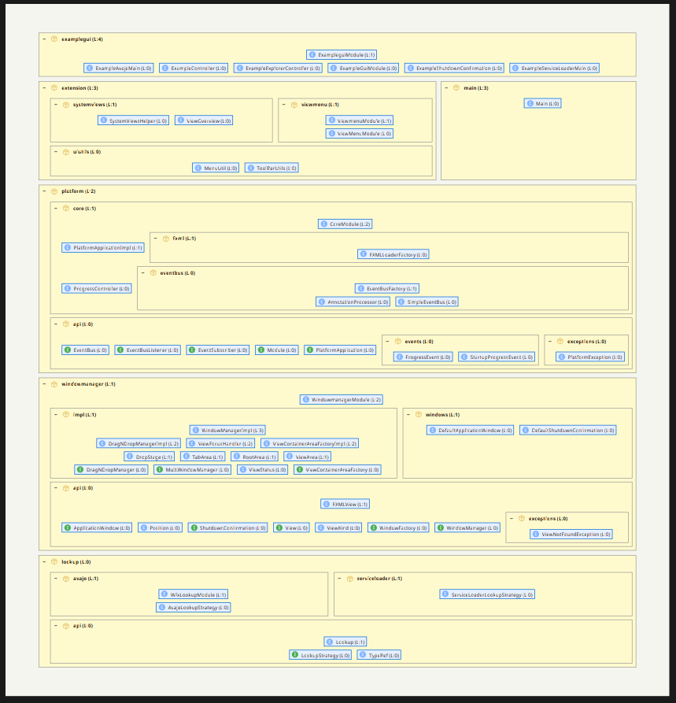
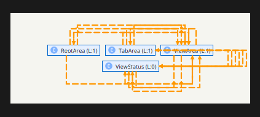
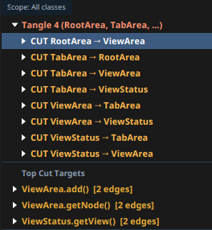
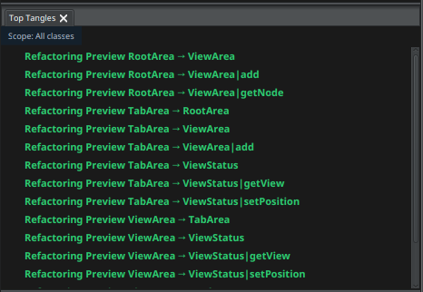
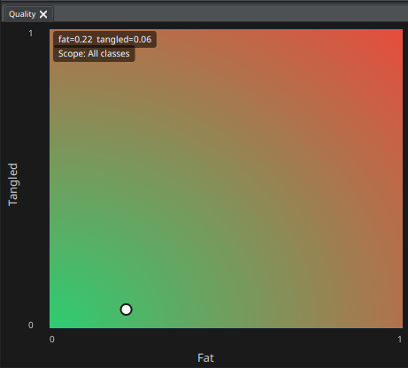
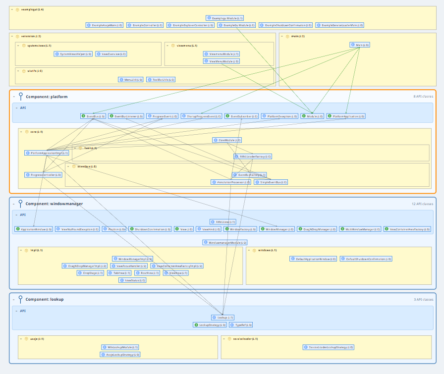
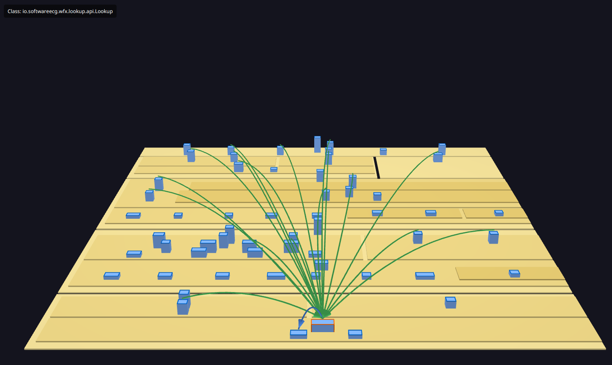
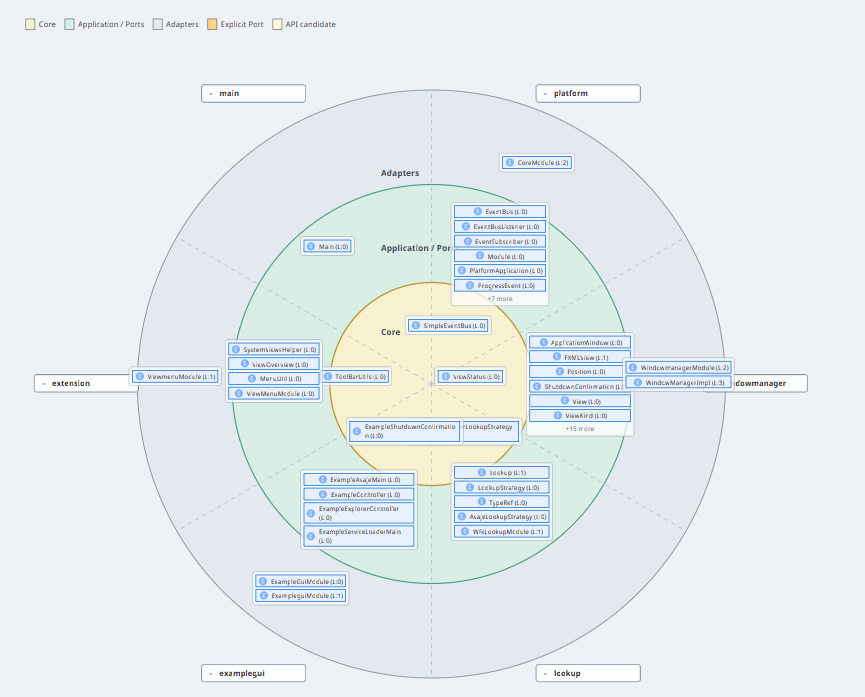

# S202 Case Studies

## Goal

This document collects concrete case studies in which S202 is applied to real or realistic codebases. Each case study should show which architectural problem became visible and which refactoring decision can be derived from it.

## Planned Structure per Case Study

1. Initial system
2. Observed structure
3. Notable cycles or violations
4. Interpretation of the findings
5. What-if analysis
6. Possible refactoring plan
7. Result or expected effect

## Case Study: Analyzing WFX

WFX is a useful case study because it is not a synthetic demo system. It is a
real framework that was actively evolved while S202 itself was being extended.
During the WFX migration, S202 was used continuously to inspect dependencies,
detect tangles, validate component boundaries, and decide which API surfaces
should become JPMS exports. The tool was therefore not only used after the
fact; it directly supported improving the WFX component architecture and made
the JPMS integration practical.

The main architectural question was:

```text
Can WFX be kept as a small set of clean platform modules whose internals are
not accidentally used by clients or other modules?
```

The following screenshots show the analysis workflow.

### 1. Layered Architecture



The layered architecture view is the baseline. It uses S202's normal
interpretation: callers are placed above the called elements, packages are
nested hierarchically, and the calculated `architectureLevel` remains the
central ordering model. In WFX this makes the main areas visible:
`examplegui`, `extension`, `main`, `platform`, `windowmanager`, and `lookup`.

Useful features in this view:

- Packages and classes can be expanded and collapsed without changing the
  underlying analysis.
- Dependency arrows can be enabled to inspect how one area uses another.
- Wrong-direction dependencies can be shown as violations when a dependency
  contradicts the calculated layer direction.
- Package tangles remain separate findings, because a cycle is a different
  problem than a single upward dependency.

For WFX this view gave the first confidence check: the framework already had
a recognizable layered shape, but some areas still needed more precise
boundary checks than a package hierarchy alone can provide.

### 2. Resolving Tangles



The tangle view focuses on strongly connected package or class groups. In the
example, a tangle around `RootArea`, `TabArea`, `ViewArea`, and `ViewStatus`
is shown with orange dashed dependency paths. This is the kind of structure
that makes a module hard to split: every element in the cycle depends, directly
or indirectly, on the others.



The Top Tangles panel turns the visual cycle into concrete refactoring
candidates. It lists cut candidates such as `RootArea -> ViewArea`,
`TabArea -> RootArea`, or `ViewStatus -> ViewArea`. This is deliberately a
preview workflow: S202 does not silently rewrite code. It helps identify which
edges would break a cycle and lets the developer reason about the design
impact.



After selecting candidate cuts, the refactoring preview shows the expected
effect. Green preview entries indicate dependencies that would be removed or
redirected by the proposed change. This helped WFX development because tangles
could be reduced before they hardened into JPMS module boundaries.


The graph view mirrors the same state visually: the formerly orange cycle is
now shown in the preview color, making it easier to check whether the proposed
cuts address the intended dependency paths.

The quality view provides an additional compact signal for the currently
selected scope.



The screenshot shows a scope with low tangling and moderate fatness. This view
is not a replacement for the dependency graph; it is a quick indicator for
whether a refactoring is improving the package shape or merely moving edges
around.

Violations visible in this part of the workflow:

- Package tangles, shown as strongly connected groups.
- Candidate cut edges that would break a tangle.
- Remaining wrong-direction edges after a cycle has been broken.

### 3. Component View



The Component View adds a stronger architectural interpretation on top of the
same dependency graph. Components are shown as top-level boxes. Each component
has an API area at the top and an implementation area below it. In the WFX
screenshot the important components are `platform`, `windowmanager`, and
`lookup`.

The API section is built from multiple sources:

- manual `Add To Api` and `Remove From Api` decisions;
- JPMS `exports` from `module-info.class`;
- package naming conventions such as `api` or `port`;
- interface/API class naming heuristics.

This view was especially important for WFX. It made the intended module
contracts visible before and during JPMS adoption. Classes such as
`ApplicationWindow`, `WindowManager`, `Lookup`, `EventBus`, and related
interfaces can be inspected as explicit API surface instead of being hidden
inside package nesting.

Component-specific violations:

- `COMPONENT_API_BYPASS`: code calls into another component's implementation
  instead of using its API.
- `COMPONENT_API_LEAKS_IMPLEMENTATION`: an API class depends on an
  implementation class and therefore leaks internals into the public contract.

This was the central view for improving WFX's component architecture. It made
it clear which dependencies were valid module usage and which ones had to be
redirected through API classes or JPMS exports.

### 4. 3D Dependency Inspection



The 3D view provides a different inspection mode. Instead of focusing on
package boxes, it renders the architecture as a layered terrain with classes
as buildings. Selecting a class highlights its dependency fan-in or fan-out.
In the screenshot the selected class is
`io.softwareecg.wfx.lookup.api.Lookup`, and the green arcs show how broadly
that API is used.

Useful features in this view:

- Large dependency fans become visually obvious.
- Central API classes stand out as hubs.
- The view helps validate whether a class belongs in an API package or whether
  it is accidentally becoming a global service locator.
- It complements the 2D views by making height, distance, and concentration
  visible at once.

The 3D view is not the primary policy engine for component or hexagonal
violations. Its value is exploratory: it helps find architectural hotspots
that should then be checked in the layered, component, or dependency panels.

### 5. Hexagonal Architecture Prototype



The Hexagonal View is the first prototype of a radial architecture projection.
It keeps the same calculated levels, but displays them as rings:

```text
Core                inside
Application / Ports middle ring
Adapters            outside
```

WFX packages or components become radial segments such as `main`, `platform`,
`windowmanager`, `lookup`, `examplegui`, and `extension`. Classes are placed
into the ring that best matches their calculated level and explicit
architecture role. API classes from the Component View become port candidates;
explicit ports can be marked as inbound, outbound, or generic.

Useful features in the prototype:

- Segments can be collapsed and expanded.
- API candidates and explicit ports are visually distinguished.
- Context-menu actions can mark classes or packages as core, adapter, inbound
  port, outbound port, or generic port.
- The Dependencies panel can show Hexagonal violations as the first section
  while the Hexagonal View is active.

Hexagonal-specific violations:

- `HEXAGON_OUTWARD_DEPENDENCY`: an inner element depends outward on an adapter
  or implementation detail.
- `HEXAGON_PORT_BYPASS`: a segment or adapter communicates with an
  implementation directly instead of crossing the boundary through a port.

For WFX this view is valuable because it reuses the Component View's API
knowledge but asks a different question: not only "what is public?", but
"does the dependency cross the architectural boundary through the right
port?". This is a promising next step for validating framework modules whose
APIs are intentionally small and whose implementations should remain hidden.

### Result

The WFX case study shows why S202 needs multiple architecture views on the
same analysis model. The layered view validates the basic dependency
direction. The tangle tools identify cycles that block modularization. The
Component View defines and checks API boundaries. The 3D view helps explore
dependency hotspots. The Hexagonal View experiments with ports and inward
dependencies.

The important design decision is that all of these views use the same
underlying dependency graph and calculated levels. WFX could therefore be
iteratively improved without changing the meaning of the existing layered
analysis. That consistency was essential while the framework was being moved
toward a cleaner component architecture and JPMS-based module boundaries.

## Candidates

- Example JAR from the concept documentation
- S202's own modules
- Historically grown package structure with large SCCs
- Target architecture that deliberately differs from the computed actual architecture
