# S202 Component Design

Sammlung von Entkopplungs- und Komponentendesign-Entscheidungen für S202.
Dieses Dokument wächst mit neuen Erkenntnissen.

## Ziel: Case Study

Die Umsetzung der hier erarbeiteten Maßnahmen ist gleichzeitig eine
**Case Study für S202 selbst**. Jeder Schritt wird mit Vorher-Nachher-
Vergleich dokumentiert: welche Violations und Abhängigkeiten das Tool
vor der Maßnahme gezeigt hat, welche Design-Entscheidung daraus folgte,
und wie die Darstellung danach aussieht.

Der entscheidende Aspekt: die gesamte Analyse in diesem Dokument wurde
**ausschließlich aus dem Tool abgeleitet** — kein direkter Blick in den
Quellcode. Altlasten, falsche Paketgrenzen, zu breite API-Oberflächen
und fehlende Interfaces wurden durch die Schichten- und Komponentensicht
von S202 sichtbar, nicht durch manuelles Code-Reading.

Das macht S202 zum Werkzeug seiner eigenen Verbesserung — und die
Ergebnisse zu einem nachvollziehbaren Beispiel dafür, was das Tool in
realen Codebasen leisten kann.

---

## 1. `reader` als Komponente mit versteckter Implementierung

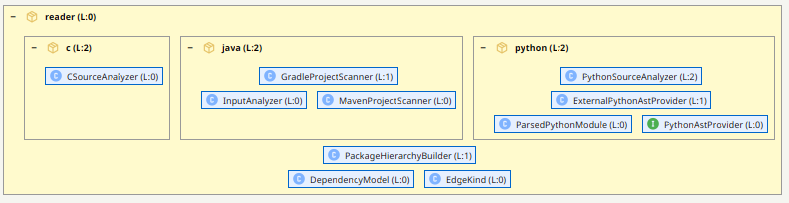

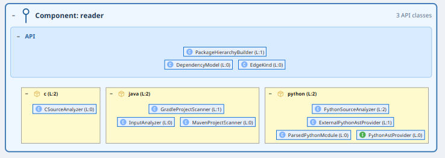

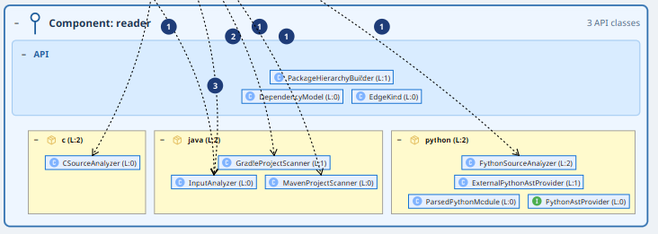

### Problem

`S202Module` kennt alle Interna des `reader`-Pakets:

```
de.weigend.s202.reader.java.InputAnalyzer
de.weigend.s202.reader.java.MavenProjectScanner
de.weigend.s202.reader.java.GradleProjectScanner
de.weigend.s202.reader.python.PythonSourceAnalyzer
de.weigend.s202.reader.c.CSourceAnalyzer
```

Eine neue Sprache erfordert heute eine Änderung in `S202Module`.

### Ziel

`reader` wird eine Komponente. Die UI sieht nur noch die Komponenten-API:

```
de.weigend.s202.reader.LanguageAnalyzer    ← Interface (API)
de.weigend.s202.reader.AnalyzerRegistry   ← Einstiegspunkt (API)
```

Alles unter `reader.java.*`, `reader.python.*`, `reader.c.*` ist
Implementierungsdetail der Komponente. Die Registrierung der konkreten
Analyzer passiert intern — per SPI oder statischer Registry, das ist
eine Implementierungsentscheidung innerhalb des `reader`-Moduls.

### Interface

```java
public interface LanguageAnalyzer {
    String displayName();
    DependencyModel analyze(List<Path> inputs) throws IOException;
}
```

`InputAnalyzer` konvertiert intern `path.toString()`. Python und C nehmen
`Path` ohnehin schon. Der Progress-Callback bleibt als optionaler Overload
auf `InputAnalyzer` — er ist ein UI-Concern, kein Teil des Analyzer-Contracts.

### UI-seitiger FileLoader

Die UI weiß, wie sie Input für bekannte Analyzer beschafft:

```java
interface FileLoader {
    String menuLabel();
    List<Path> chooseInput(Window owner);
}
```

Bekannte Analyzer (`JarFileLoader`, `MavenProjectLoader`,
`GradleProjectLoader`) bekommen dedizierte `FileLoader`-Implementierungen.
Neue Sprachen, die per SPI reinkommen, bekommen automatisch einen
`GenericDirectoryLoader`. Wer einen spezialisierten Chooser will, kann
optional einen passenden `FileLoader` dazuregistrieren.

### Ergebnis

- `reader` hat eine klare API-Grenze — keine direkten Zugriffe der UI auf
  Implementierungsklassen.
- Eine neue Sprache = neuer `LanguageAnalyzer` + SPI-Eintrag, kein
  Anfassen von `S202Module`.
- Der `FileLoader`-Gedanke bleibt in der UI und arbeitet gegen
  `LanguageAnalyzer.displayName()`.

### Ergebnisnachweis

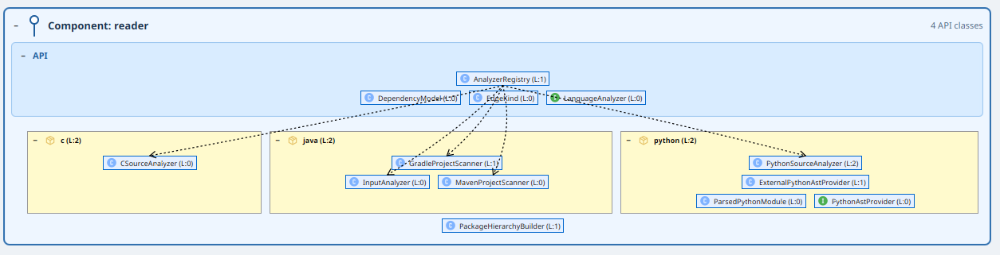

`LanguageAnalyzer` und `AnalyzerRegistry` bilden die API. `AnalyzerRegistry`
kennt jedoch noch die konkreten Analyzer — die gestrichelten Pfeile zeigen
Abhängigkeiten aus der Impl-Ebene in die API, was eine zyklische Kopplung
zwischen API und Impl bedeutet.

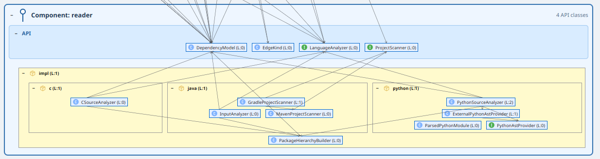

`AnalyzerRegistry` ist verschwunden. Die konkrete Analyzer-Registrierung
übernimmt Avaje Inject per Service-Lookup — die API kennt die Impl nicht
mehr. Alle eingehenden Abhängigkeiten zeigen nur noch auf API-Klassen,
kein Pfeil geht in Gegenrichtung.

---

## 2. `SCCVisualizationHelper` — Altlast, kann gelöscht werden

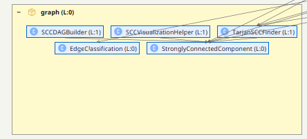

`de.weigend.s202.graph.SCCVisualizationHelper` hat keinen einzigen Aufrufer
außerhalb seiner eigenen Klassendefinition. Die Klasse ist toter Code.

Inhaltlich ist sie durch neuere Mechanismen vollständig ersetzt:

| Methode | Ersatz |
|---|---|
| `getTangles()` | `DomainModel.getPackageTangles()`, `SCCRenderer` |
| `generateSummary()` / `ArchitectureSummary` | kein Abnehmer — nie integriert |
| `sortTangleMembers()` | früher Layoutversuch; ersetzt durch `rank(P)` in `LevelCalculator` |

Zusätzlich ist der Name strukturell falsch: eine Klasse mit "Visualization"
im Namen gehört nicht ins `graph`-Paket (Domain-Graph-Infrastruktur).

**Aktion:** Datei löschen.

### Ergebnisnachweis


---

## 3. `SCCDAGBuilder` — Altlast, kann gelöscht werden

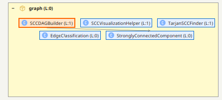

`de.weigend.s202.graph.SCCDAGBuilder` wird im Produktionscode nirgendwo
aufgerufen. Einziger Aufrufer ist `SCCDAGBuilderTest`, der die Klasse
künstlich am Leben hält.

Die Funktionalität ist vollständig im `LevelCalculator` enthalten: dieser
baut ebenfalls einen SCC-DAG und berechnet Levels per Longest-Path — aber
mit `rank(P)`-Mechanismus und Paket-Hypothese. `SCCDAGBuilder` kennt
beides nicht und würde allein keine korrekten Architekturlevels liefern.

**Aktion:** Klasse und begleitenden `SCCDAGBuilderTest` löschen.

### Ergebnisnachweis


---

## 4. `EdgeClassification` — verschieben, nicht löschen

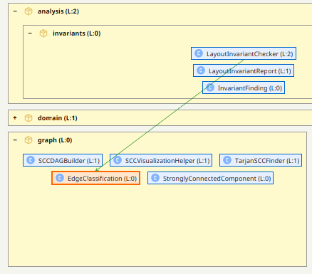

`de.weigend.s202.graph.EdgeClassification` hat genau einen Aufrufer im
Produktionscode: `LayoutInvariantChecker`. Kein anderer Code braucht sie.

Als eigenständige public Klasse im `graph`-Paket suggeriert sie eine
allgemeine Nutzbarkeit, die nicht existiert. Die Klasse ist ausschließlich
ein Implementierungsdetail der Invariantenprüfung.

**Aktion:** Als `private static` Hilfsklasse in `LayoutInvariantChecker`
verschieben (oder package-private im `analysis.invariants`-Paket, falls
der Checker zu groß wird). Aus dem `graph`-Paket entfernen.

### Ergebnisnachweis

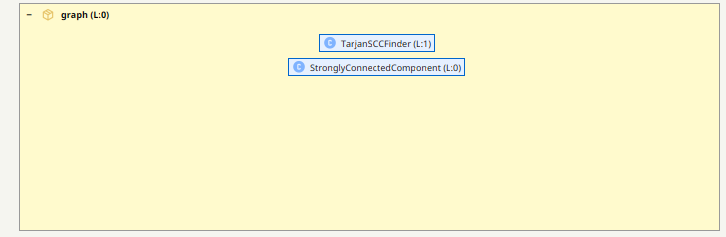

---

## 5. `graph`-Paket auflösen — Inhalt in `domain` überführen


Nach den Löschungen aus Punkt 2–4 verbleiben im `graph`-Paket nur noch
zwei Klassen: `TarjanSCCFinder` und `StronglyConnectedComponent`.
Das Paket als eigenständige Ebene ist damit nicht mehr gerechtfertigt.

### Ziel

Das `graph`-Paket verschwindet. Sein Inhalt wird in `domain` überführt
mit einer sauberen API/Impl-Trennung:

**Domain-API** (öffentlich sichtbar für `domain`, `analysis`, `ui`):
```
de.weigend.s202.domain.SCCFinder                  ← neues Interface
de.weigend.s202.domain.StronglyConnectedComponent ← Ergebnistyp, Teil der Schnittstelle
```

`StronglyConnectedComponent` ist der Rückgabetyp von `SCCFinder` und
damit zwingend Teil der API — ohne ihn kann kein Aufrufer mit dem Ergebnis
arbeiten.

**Domain-Impl** (Implementierungsdetail, nicht direkt importierbar):
```
de.weigend.s202.domain.impl.TarjanSCCFinder       ← implementiert SCCFinder
```

### Interface

```java
public interface SCCFinder {
    List<StronglyConnectedComponent> findSCCs(Map<String, Set<String>> graph);
}
```

### Ergebnis

- Das `graph`-Paket verschwindet vollständig.
- Alle bisherigen Aufrufer (`LevelCalculator`, `LayoutInvariantChecker`,
  `SCCRenderer`, etc.) importieren künftig aus `domain` statt aus `graph`.
- `TarjanSCCFinder` ist nicht mehr direkt instanziierbar von außen.

### Ergebnisnachweis

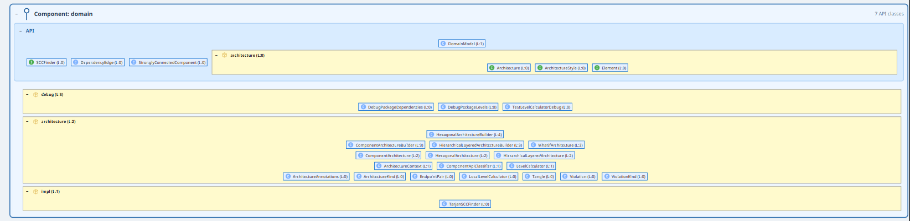

---

## 6. `domain` als Komponente — API-Schnitt


### Problem

`domain` ist heute kein Komponent sondern ein Paket-Namespace. `S202Module`
und die UI instanziieren `LevelCalculator`, `LocalLevelCalculator` und alle
drei Builder direkt. Alles ist implizit API.

### Zwei Verantwortlichkeiten

`domain` hat intern zwei klar trennbare Verantwortlichkeiten:

1. **Computation** — `DependencyModel → DomainModel`
   (`LevelCalculator` + `LocalLevelCalculator`)
2. **Projection** — `DomainModel + Annotations → Architecture`
   (die drei Builder)

Für beide existiert bereits ein Interface-Ansatz oder lässt sich einer
einführen.

### Zwei neue/angepasste Interfaces

```java
// Computation (neu)
public interface DomainComputer {
    DomainModel compute(DependencyModel input);
}

// Projection (existiert bereits)
public interface ArchitectureStyle {
    ArchitectureKind kind();
    Architecture build(ArchitectureContext ctx);
}
```

`LevelCalculator` + `LocalLevelCalculator` verschwinden hinter
`DomainComputer`. Die drei Builder verschwinden hinter `ArchitectureStyle`.
`ComponentApiClassifier` ist dann ein internes Hilfsmittel der Builder.

### API-Oberfläche

| Typ | Klasse/Interface |
|---|---|
| Interface | `Architecture` |
| Interface | `DomainComputer` (neu) |
| Interface | `ArchitectureStyle` |
| Daten | `DomainModel` |
| Daten | `ArchitectureAnnotations` |
| Daten | `ArchitectureContext` |
| Daten | `Element` |
| Daten | `Tangle` |
| Daten | `Violation` |
| Enum | `ArchitectureKind` |
| Enum | `ViolationKind` |

Dazu die vier konkreten Architecture-Projektionen (siehe Punkt unten).

### Impl (versteckt)

```
LevelCalculator, LocalLevelCalculator  ← impl DomainComputer
HierarchicalLayeredArchitectureBuilder ← impl ArchitectureStyle
ComponentArchitectureBuilder           ← impl ArchitectureStyle
HexagonalArchitectureBuilder           ← impl ArchitectureStyle
ComponentApiClassifier                 ← intern in Buildern
```

### Ergebnisnachweis

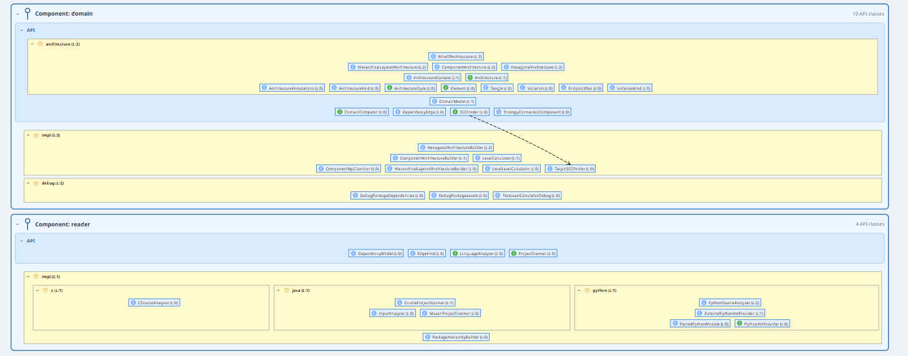

---

## 7. `sealed Architecture` ablösen — offene Interface-Hierarchie

### Problem

`Architecture` ist aktuell ein `sealed interface` das nur explizit
aufgeführte Subtypen erlaubt. Das erzwingt an jeder Verwendungsstelle
einen exhaustiven Switch über alle konkreten Typen. Neue Architekturstile
brechen bestehenden Code.

Tiefer liegendes Problem: die verschiedenen Stile sind keine Variationen
desselben Konzepts, sondern fachlich unterschiedliche Modelle mit je
eigenen Domain-Konzepten:

- **Layered**: Level, Schichtenordnung, Back-Edges
- **Component**: API-Klassifikation, Komponentengrenzen, Bypass-Erkennung
- **Hexagonal**: Ports, Ringe, Adapter-Rollen, Inward/Outward-Richtung

Ein gemeinsames `violations()`/`tangles()`-Interface ist der kleinste
gemeinsame Nenner und verschleiert diese Unterschiede.

### Lösung: offene Vererbung statt sealed

```java
public interface Architecture {
    List<Violation> violations();
    List<Tangle> tangles();
}

public interface LayeredArchitecture extends Architecture {
    List<List<Element>> rows();
    // weitere layered-spezifische Methoden
}

public interface ComponentArchitecture extends Architecture {
    List<ComponentElement> components();
    // weitere component-spezifische Methoden
}

public interface HexagonalArchitecture extends Architecture {
    List<HexRing> rings();
    List<HexPort> ports();
    // weitere hexagonal-spezifische Methoden
}
```

Die konkreten Implementierungen (`HierarchicalLayeredArchitecture` etc.)
implementieren die jeweiligen Sub-Interfaces. Da der Interface-Name dann
besetzt ist, müssen die Implementierungsklassen umbenannt werden —
z.B. `HierarchicalLayeredArchitectureImpl` oder die Interfaces erhalten
sprechendere Namen wie `LayeredView`.

### Vorteile gegenüber sealed

- Neue Stile brechen keinen bestehenden Code
- Jeder Konsument arbeitet mit genau dem Interface das er braucht,
  kein Cast, kein exhaustiver Switch
- Stil-spezifische Domain-Konzepte können das Interface natürlich
  erweitern ohne den gemeinsamen Vertrag anzufassen
- Wächst ein Stil fachlich, wächst sein Interface — unabhängig von
  den anderen

---

## 8. `project` als Komponente — `ProjectStore`-Interface

### Ist-Stand

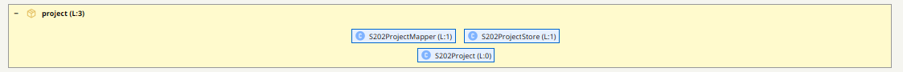

Alle drei Klassen des `project`-Pakets sind direkt von außen importiert:

| Klasse | Rolle |
|---|---|
| `S202Project` | Record mit Persistenz-DTOs — das Dateiformat |
| `S202ProjectStore` | `save`/`load` auf Disk (JSON) |
| `S202ProjectMapper` | Konvertierung Domain ↔ DTOs |

`S202Module` instanziiert `S202ProjectStore` und `S202ProjectMapper` direkt.

### Ziel

Ein Interface für die Store-Operation, der Mapper wird Implementierungsdetail:

```java
public interface ProjectStore {
    void save(Path path, S202Project project) throws IOException;
    S202Project load(Path path) throws IOException;
}
```

`S202ProjectStore` implementiert `ProjectStore`. `S202ProjectMapper` ist
nicht mehr public — er wird intern vom `S202ProjectStore` verwendet und
verschwindet aus der API-Oberfläche.

`S202Project` bleibt API-Datentyp, solange der Aufrufer das Projekt selbst
zusammenstellt. Mittelfristig könnte der Store eine höhere Abstraktion
anbieten (`save(DomainModel, ArchitectureAnnotations, ...)`) — dann wird
auch `S202Project` zum Implementierungsdetail. Das ist ein separater Schritt.

### Ergebnis

- `project`-Komponente exportiert: `ProjectStore` (Interface), `S202Project` (Daten)
- `S202ProjectMapper` und `S202ProjectStore` sind versteckte Impl

---

## 9. UI — bewusst außerhalb dieses Schritts


Die UI-Schicht (`de.weigend.s202.ui`) bleibt in diesem Schritt monolithisch.
Sie wird nicht als Komponente neu geschnitten.

Verbesserungen an der UI erfolgen chirurgisch dort, wo es konkret nötig
ist — z.B. wenn ein neues WFX-Modul eine saubere Grenze erfordert oder
eine Klasse nachweislich zu viel verantwortet. Kein großer Rewrite.

**Was dieser Schritt liefert:**
Die UI-Schicht bekommt saubere Gegenstücke: `LanguageAnalyzer`, `ProjectStore`,
`DomainComputer`, `ArchitectureStyle` — alles was sie heute direkt
instanziiert, wird durch Interfaces ersetzt. Die UI selbst ändert ihre
interne Struktur dabei nicht.

---

## 10. Einheitliches Paketlayout für alle Komponenten

### Konvention: `name` == API, `name.impl` == Implementierung

Das Top-Level-Paket einer Komponente ist ihre öffentliche API.
Implementierungsdetails liegen im Unterpaket `name.impl`.

**Vorteile:**
- API-Typen haben natürliche, kurze Importpfade ohne `.api.`-Rauschen
- Durchsetzbar per `module-info.java`: `exports name` aber nicht `exports name.impl`
- Passt zur bestehenden Struktur — `reader.java`, `reader.python`, `reader.c`
  sind bereits natürliche Impl-Unterpakete, kein Umbenennen nötig

### Kein JPMS — aber JPMS-kompatibles Design

`module-info.java` wird **nicht** eingeführt. Der Mehrwert für ein agil
entwickeltes Werkzeug dieser Größe ist gering, der Aufwand bei
Refactorings und Abhängigkeitsänderungen aber spürbar — JPMS behindert
schnelle Iterationen.

Das Paketlayout wird jedoch so gestaltet, dass eine spätere JPMS-Migration
ohne konzeptionelle Änderungen möglich ist: API-Pakete wären `exports`,
`*.impl`-Pakete würden schlicht nicht exportiert.

### Anwendung auf alle Komponenten

```
de.weigend.s202.reader          ← API: LanguageAnalyzer, AnalyzerRegistry
de.weigend.s202.reader.java     ← Impl (bleibt wie heute)
de.weigend.s202.reader.python   ← Impl (bleibt wie heute)
de.weigend.s202.reader.c        ← Impl (bleibt wie heute)

de.weigend.s202.domain          ← API: Architecture, DomainComputer,
                                       ArchitectureStyle, DomainModel,
                                       SCCFinder, StronglyConnectedComponent,
                                       Violation, Tangle, Element, ...
de.weigend.s202.domain.impl     ← Impl: LevelCalculator, LocalLevelCalculator,
                                        TarjanSCCFinder, alle Builder,
                                        ComponentApiClassifier

de.weigend.s202.project         ← API: ProjectStore, S202Project
de.weigend.s202.project.impl    ← Impl: S202ProjectStore, S202ProjectMapper
```

---
