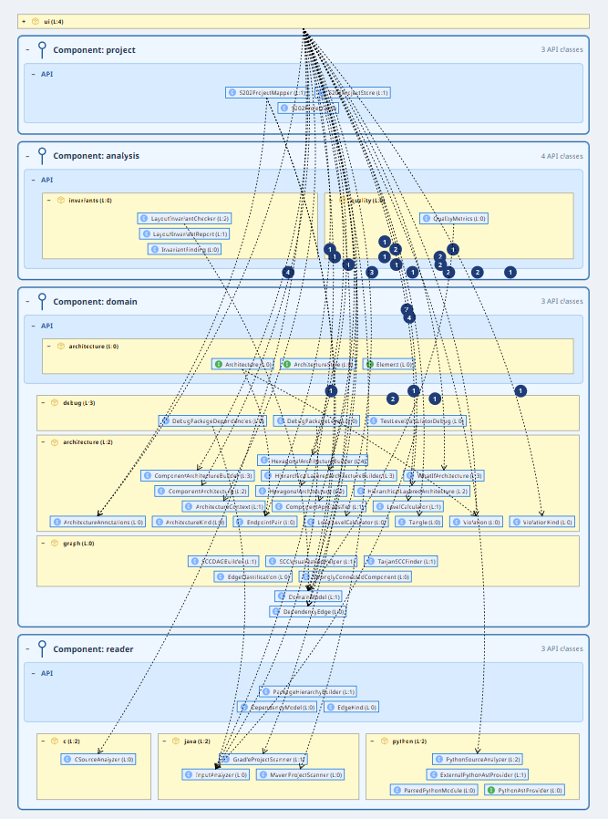
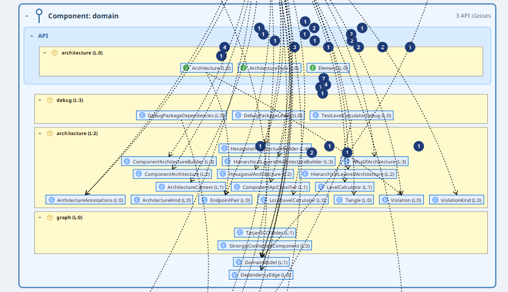
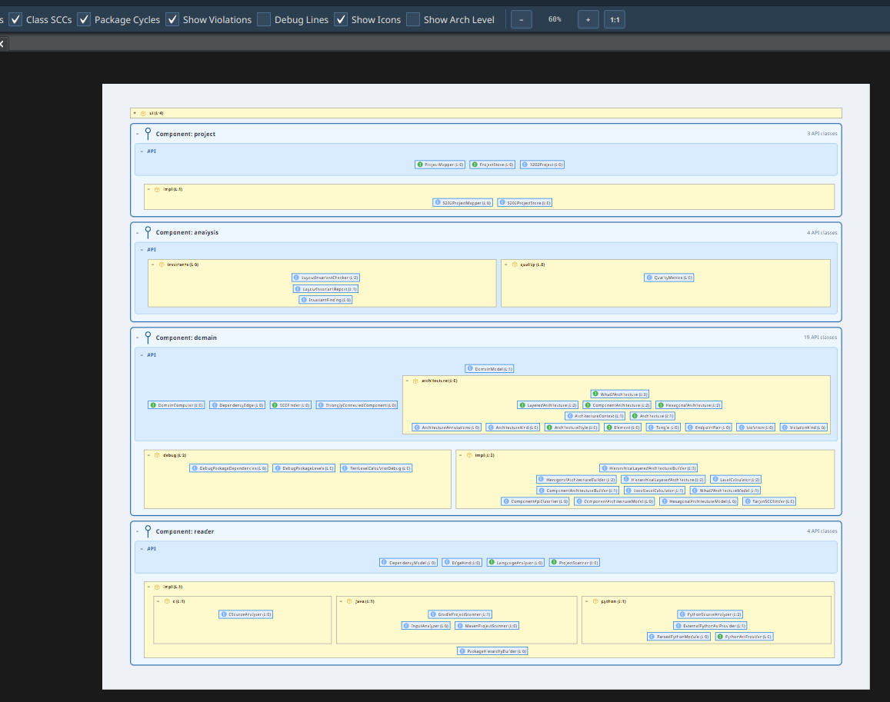

# Wer räumt nach der KI auf?
*Software-Architektur als Arbeitsmodell für generierte Java-Systeme*

Johannes Weigend

## Zusammenfassung

KI-Assistenten wie Codex, Claude Code, GitHub Copilot oder JetBrains AI Assistant beschleunigen die Softwareentwicklung massiv. Damit entsteht nicht nur schneller Code, sondern auch schneller Architektur. Dieser Artikel diskutiert, warum Architekturarbeit dadurch nicht verschwindet, sondern dringender wird: Menschen müssen weiterhin verstehen, verantworten und korrigieren, was im System strukturell entsteht. Am Beispiel des Open-Source-Werkzeugs S202 wird gezeigt, wie sich Java-Bytecode in eine prüfbare Architekturhypothese überführen lässt. Die Darstellung macht Paketstruktur, Schichtung, Zyklen, Back-Edges und Verletzungen sichtbar und unterstützt What-If-Analysen für Refactorings. Der Beitrag richtet sich an Java-Teams, Architekten und Studierende, die KI-generierten oder KI-unterstützt veränderten Code bewerten wollen.

## Wenn Code schneller entsteht als Verständnis

Softwareentwicklung hat eine neue Geschwindigkeit erreicht. Ein Entwickler kann heute mit einem KI-Assistenten in wenigen Minuten ein lauffähiges Feature, eine REST-Schnittstelle, ein Datenmodell, Tests und Build-Konfiguration erzeugen lassen. Was früher Tage dauerte, entsteht nun in einem Dialog. Das ist ein echter Fortschritt: Boilerplate verschwindet, Experimente werden billiger, und viele klassische Anfängerfehler treten seltener auf.

Die Kehrseite ist weniger spektakulär, aber architektonisch wichtiger. Wenn Code schneller entsteht, entstehen auch technische Schulden schneller. KI-Assistenten bauen geduldig ein Feature nach dem anderen ein. Sie murren nicht, wenn eine Klasse weiter wächst, wenn ein Service noch eine Verantwortung bekommt oder wenn eine Abhängigkeit in die falsche Richtung zeigt. Sie können in einem großen Kontext erstaunlich lange den lokalen Überblick behalten. Genau das verschiebt den Moment, in dem ein menschliches Team normalerweise sagt: Stop, wir brauchen eine Architekturentscheidung.

Damit ist KI-generierter Code nicht automatisch schlechter als handgeschriebener Code. Oft ist er lokal sogar sauber: Namen sind plausibel, Tests existieren, Framework-Konventionen werden eingehalten. Das Problem liegt eine Ebene höher. Architektur ist keine lokale Eigenschaft. Sie entsteht aus Abhängigkeiten, Verantwortlichkeiten, Grenzen und der Frage, welche Teile eines Systems andere Teile kennen dürfen. Diese Struktur wird bei iterativer Entwicklung leicht unscharf, egal ob der Code von Menschen, von KI-Assistenten oder von beiden gemeinsam geschrieben wurde.

Die zentrale Frage für die Developer Experience ist deshalb nicht nur: Wie schnell kann ich Code erzeugen? Sondern auch: Wie schnell kann ich verstehen, was ich erzeugt habe?

## Architektur bleibt menschliche Verantwortung

KI kann Refactorings erstaunlich schnell ausführen. Sie kann Klassen aufteilen, Tests anpassen, Methoden verschieben, Abhängigkeiten durch Interfaces ersetzen oder ein Modul in ein anderes Build-Artefakt auslagern. Aber sie entscheidet nicht zuverlässig, welche Struktur für ein Produkt langfristig tragfähig ist. Diese Entscheidung hängt an Domänenwissen, Teamorganisation, Release-Prozessen, Sicherheitsanforderungen und an Erwartungen, die nicht vollständig im Code stehen.

Deshalb verschiebt KI die Rolle von Entwicklerinnen und Entwicklern. Ein Teil der Arbeit wandert vom Tippen zum Steuern, Prüfen und Entscheiden. Menschen brauchen dafür Werkzeuge, die nicht nur einzelne Codezeilen bewerten, sondern die Struktur eines Systems lesbar machen. Ein Pull Request mit 4.000 Zeilen KI-generiertem Code ist für ein klassisches Review kaum noch sinnvoll erfassbar, wenn das Review nur Datei für Datei betrachtet. Interessant sind Fragen wie:

- Welche neuen Abhängigkeiten und Komponenten sind entstanden, und wie wurden sie integriert?
- Was wurde entkoppelt, was zusammengeführt?
- Gibt es Zyklen zwischen Paketen — und welche Schnitte würden sie auflösen?
- Welche Klassen wurden falsch platziert?

Solche Fragen sind nicht neu. Sie werden durch KI nur dringlicher, weil die Menge und Geschwindigkeit der Änderungen steigt.

## Von Dateien zu Befunden

Ein Java-Projekt sieht auf der Platte zunächst geordnet aus: Packages, Maven-Module, Gradle-Projekte, Verzeichnisse und JAR-Dateien. Diese Ordnung hilft beim Finden von Dateien, ist aber nicht automatisch Architektur. Ein Paket `service` kann sauber benannt sein und trotzdem quer durch `api`, `core`, `infra` und `ui` greifen.

Architektur zeigt sich im Code vor allem durch gerichtete Abhängigkeiten. In einer geschichteten Darstellung steht die nutzende Klasse oben, die genutzte darunter. Eine Kante nach oben ist auffällig, weil sie auf eine gebrochene Schichtung, einen Zyklus oder eine unklare Verantwortung hinweisen kann.

Das ist die bekannte Idee hinter Tools wie Structure101: Containment macht die verschachtelte Struktur sichtbar, Levelization ordnet diese Container nach ihren Abhängigkeiten. Structure101 konnte davon schon sehr viel. Für mich war es über Jahre das Arbeitsmodell, das ich als Architekt haben wollte: nicht nur Dateien, sondern eine Karte der tatsächlichen Kopplung.

Warum also noch ein neues Werkzeug? Vor der KI-Zeit wäre S202 kaum finanzierbar gewesen. Der Markt für ein spezialisiertes Architekturwerkzeug ist klein, und ein etabliertes Produkt deckte viele Anforderungen bereits ab. KI verändert hier nicht die Architekturtheorie, sondern die Ökonomie: Ein Nischenwerkzeug lässt sich heute in fokussierten Claude- oder Codex-Sessions bauen, umbauen und auf konkrete Situationen zuschneiden.

Genau daraus entstand S202: zuerst als Structure101-inspiriertes Arbeitsmodell für Java-Bytecode, dann immer stärker als Architekturwerkbank. S202 ist Open Source unter der Apache-2.0-Lizenz: [github.com/Weigend/S202](https://github.com/Weigend/S202). Heute liest S202 auch Python- und C-Quellbäume in dasselbe Abhängigkeitsmodell ein. Neben klassischer Schichtung unterstützt es Komponentenarchitekturen mit expliziten API-Flächen, Implementierungsbereichen und Verletzungen wie "Komponente umgeht API" oder "API leakt Implementierung".

Der interessante Teil ist aber nicht, dass S202 existiert. Interessant ist, was passierte, als S202 auf sich selbst angewendet wurde.

## Die Case Study: S202 analysiert S202

Der Versuch war absichtlich nüchtern. Die S202-Anwendung wurde gebaut, als JAR geladen und in der Komponentenansicht geöffnet. Für die erste Befundaufnahme wurden keine Quelldateien gelesen, keine Imports gesucht und keine IDE-Navigation benutzt. Nur die Darstellung war erlaubt.

*Abbildung 1: Ausgangszustand der S202-Selbstanalyse. Die gestrichelten Linien zeigen Zugriffe über Komponentengrenzen hinweg auf Implementierungsdetails.*

Die vier großen Bereiche waren bereits erkennbar: `project`, `analysis`, `domain` und `reader`. Aber fast jede Grenze war porös. Die UI instanziierte konkrete Analyseklassen, das Domänenmodell hatte kaum eine API, und Reader-Implementierungen für Java, Python und C waren von außen sichtbar. Klassen wie `LevelCalculator`, `TarjanSCCFinder` oder `S202ProjectStore` wurden direkt verwendet, obwohl sie interne Bausteine sein sollten.

Aus dem Diagramm entstand eine Refactoring-Liste:

| Bereich | Befund und Architekturschluss |
|---|---|
| `reader` | Java-, Python- und C-Implementierungen hinter `LanguageAnalyzer` und `ProjectScanner` verstecken |
| `domain` | Rechner und Builder hinter `DomainComputer`, `ArchitectureStyle` und Architektur-Interfaces legen |
| `project` | `ProjectStore` als API einführen, Implementierung nach `project.impl` verschieben |
| Cleanup | Tote Klassen löschen, falsch platzierte Klassen verschieben, verwaistes `graph`-Paket auflösen |
| Architekturmodell | `sealed`-Hierarchie öffnen und typisierte Sub-Interfaces für neue Architekturstile einführen |

Entscheidend ist nicht die Menge der Befunde, sondern ihre Herkunft. Es waren keine Stilmeinungen und keine generischen "Clean Architecture"-Ratschläge. Jeder Punkt war als Abhängigkeit im Modell sichtbar. Die Liste war deshalb auch für eine KI-Session brauchbar: Nicht "mach die Architektur besser", sondern "diese konkrete Klasse soll nicht mehr von außen erreichbar sein" oder "diese Komponente braucht eine API".

## API-Flächen statt hübscher Paketnamen

Die sichtbarste Schwäche lag im Domänenbereich. Auf dem Papier klingt `domain` nach einem stabilen Kern. Im Diagramm war `domain` aber eher ein Sammelraum: API-Klassen, Implementierungen, Debug-Helfer, Architekturbuilder und alte Graphklassen lagen im selben öffentlichen Bereich. Die Nutzer der Domäne griffen direkt auf konkrete Implementierungen zu.

*Abbildung 2: Der Domain-Schnitt vor dem Refactoring. Die gestrichelten Linien zeigen, dass andere Komponenten konkrete Implementierungen statt die API verwenden.*

Der erste Reflex wäre, die Packages umzubenennen. Das hätte das Problem aber nur kosmetisch verschoben. Die eigentliche Frage lautete: Welche Begriffe müssen von außen stabil sein, und welche sind nur Implementierung?

Daraus entstanden die eigentlichen Umbauten:

- `DomainComputer` wurde zum öffentlichen Einstiegspunkt für Berechnungen.
- `ArchitectureStyle` kapselt die Auswahl der Architekturprojektion.
- `LayeredArchitecture`, `ComponentArchitecture` und `HexagonalArchitecture` wurden eigene Interfaces, weil diese Modelle unterschiedliche Fachbegriffe haben.
- Konkrete Records, Builder und SCC-Implementierungen wanderten nach `domain.impl`.

Ein kleiner Befund war besonders lehrreich: Ein statischer Convenience-Default in `SCCFinder` erzeugte direkt `new TarjanSCCFinder()`. Das sah harmlos aus, bedeutete aber: Die API kannte ihre Implementierung. Genau diese eine Kante hielt eine zyklische Abhängigkeit am Leben. Nach der Umstellung auf Lookup verschwand sie.

Solche Stellen sind typisch für KI-unterstützte Codebasen. Ein Assistent erzeugt sehr schnell eine bequeme statische Methode, weil sie lokal sinnvoll ist. Erst das Abhängigkeitsbild zeigt, dass der Komfort eine Architekturgrenze beschädigt.

## Aufräumen ist auch Architektur

Die Case Study zeigte außerdem, dass Architekturarbeit nicht nur aus großen Mustern besteht. Manchmal lautet der wichtigste Befund schlicht: Diese Klasse wird von niemandem benutzt.

`SCCVisualizationHelper` hatte keine eingehenden Abhängigkeiten. `SCCDAGBuilder` wurde nur noch durch den eigenen Test gehalten. Beide Klassen waren Überbleibsel früherer Implementierungsphasen. Ohne Abhängigkeitsbild sind solche Klassen oft schwer zu bewerten, weil ihr Name wichtig klingt. Im Modell waren sie nüchtern sichtbar: keine Nutzer, keine Rolle.

`EdgeClassification` lebte noch, aber an der falschen Stelle. Ihr einziger fachlicher Nutzer lag in `analysis.invariants`, nicht im alten `graph`-Paket. Nach dem Verschieben blieb dort nur noch SCC-Infrastruktur. Daraus wurde kein neues Mini-Modul, sondern ein weiterer Architekturentscheid: `graph` verschwindet, SCC ist Teil der Domäne.

Solche kleinen Entscheidungen verhindern, dass sich eine Codebasis in halbvergessene technische Zwischenstände aufteilt.

## Das Ergebnis war nicht automatisch, aber prüfbar

Nach den Umbauten wurde S202 erneut auf S202 angewendet. Die gleiche Ansicht, die vorher die Verletzungen gezeigt hatte, zeigte nun keine komponentenübergreifenden Zugriffe auf Implementierungsdetails mehr.

*Abbildung 3: Nach dem Refactoring sind die Komponenten über ihre API-Flächen erreichbar. Die Implementierungsbereiche bleiben intern.*

Die vollständige Abhängigkeitsansicht ist dabei nicht leer. Das wäre auch kein sinnvolles Ziel. Die UI darf die Domäne benutzen. Die Domäne darf Reader-Modelle verwenden. Das Projektmodul darf gelesen und gespeichert werden. Entscheidend ist, dass diese Abhängigkeiten über die vorgesehenen API-Flächen laufen.

*Abbildung 4: Die Abhängigkeiten sind weiterhin sichtbar, aber sie verletzen die Komponentenstruktur nicht mehr.*

Die harte Messung blieb knapp: 61 Komponentenverletzungen und 22 öffentlich sichtbare Implementierungsklassen gingen auf 0; dazu kamen 5 umgesetzte Cleanup-Befunde. Für die Befundaufnahme wurden keine Quellcodezeilen gelesen.

Das ist kein Beweis, dass S202 nun "perfekt" gebaut ist. Es beweist nur etwas Nützlicheres: Eine Architekturregel wurde explizit formuliert, im Code geprüft, beim Umbau verwendet und danach erneut gemessen. Genau dieser kurze Regelkreis ist in KI-gestützter Entwicklung wertvoll.

## Warum KI diese Werkzeuge verändert

Der Bau von S202 war selbst ein Experiment in KI-gestützter Architekturarbeit. Claude Code und Codex halfen beim Implementieren von Parsern, Tests, UI-Ansichten, Layoutvarianten und Refactorings. Die Architekturentscheidungen kamen aber nicht aus der KI. Sie kamen aus dem sichtbaren Modell und aus der Frage, welche Struktur langfristig tragfähig sein soll.

Vor KI war ein Werkzeug wie S202 schwer zu rechtfertigen. Für ein breites Produkt müsste man viele Sprachen, Build-Systeme, Frameworks und Sonderfälle unterstützen. Für ein kleines Team oder einen einzelnen Architekten wäre genau diese Breite zu teuer. Die Folge war oft: Man akzeptierte ein generisches Tool oder arbeitete weiter mit IDE, Diagramm und Erfahrung.

KI verändert den Aufwand für Spezialisierung. Wenn ein Unternehmen eine besondere Konvention hat, kann ein Assistent in kurzer Zeit helfen, einen passenden Reader, eine Heuristik oder eine Architekturregel zu ergänzen. Wenn ein Framework eigene Begriffe hat, kann die Visualisierung erweitert werden. Wenn neben Java auch Python- oder C-Teile relevant sind, müssen diese nicht in eine fremde Sicht gepresst werden, sondern können in dasselbe Abhängigkeitsmodell eingelesen werden.

Das macht S202 für KI-Codebasen besonders interessant. KI-Assistenten erzeugen nicht nur Code, sie erzeugen schnell Varianten. Eine Architekturwerkbank muss deshalb ebenfalls veränderbar sein. Sie muss Komponenten, Framework-Konventionen und Firmenregeln aufnehmen können, ohne dass daraus ein mehrmonatiges Tool-Projekt wird.

Die kleine Annotation-Bibliothek `s202-annotations` ist ein Beispiel dafür. Mit `@S202Component`, `@S202Api` und `@S202Package` kann ein Team seine Komponententopologie im Code versionieren. Die Information liegt nicht in einer UI-Konfiguration auf einem Arbeitsplatz, sondern in `package-info.java` und wird beim Analysieren aus dem Bytecode gelesen. Das ist keine große Idee. Aber es ist genau die Art von kleiner, spezifischer Funktion, die früher leicht unter den Tisch gefallen wäre, weil sie für ein Massenprodukt zu speziell und für ein Einzelprojekt zu teuer war.

## Was S202 dabei besser macht

S202 ist nicht einfach eine freie Kopie eines alten Werkzeugs. Das Vorbild Containment und Levelization bleibt wichtig, aber die Anforderungen haben sich verschoben. Komponentenarchitekturen sind nicht nur Schichten mit anderen Namen: Ein erlaubter Zugriff auf `domain.architecture.Architecture` ist etwas anderes als ein direkter Zugriff auf `domain.impl.LevelCalculator`. Diese Unterscheidung ist in KI-Reviews wichtig, weil generierter Code oft den gerade sichtbaren konkreten Typ verwendet, wenn ihm keine harte Grenze entgegensteht.

Auch Sprache ist heute weniger stabil als früher. Ein Produkt kann Java-Services, Python-Automatisierung, C-Bibliotheken und Konfigurationsartefakte enthalten. S202s Reader-Schnittstelle ist deshalb offen; Java-Bytecode ist der robuste Startpunkt, Python und C zeigen die Erweiterbarkeit, Go und TypeScript sind geplant. Ein erster Reader für eine beliebige Sprache, der Imports und Aufrufe in das gemeinsame DependencyModel übersetzt, lässt sich mit KI-Unterstützung in einer fokussierten Vibe-Coding-Session oft in unter einer Stunde bauen.

Dasselbe gilt für Architekturprojektionen. Neben der klassischen Schichtung gibt es Komponenten- und Hexagonal-Sichten, alle auf demselben DependencyModel. In What-If-Analysen kann zudem eine Zielordnung ausprobiert werden, ohne den Code zu ändern. Für KI-Refactorings ist das entscheidend: Der Mensch formuliert das Zielbild, die KI hilft bei der Umsetzung, und das Modell prüft anschließend, ob die Struktur wirklich besser geworden ist.

## Grenzen

S202 kann keine fachliche Architekturabsicht aus dem Nichts lesen. Wenn ein System bewusst gegen eine klassische Schichtung gebaut ist, zeigt S202 zunächst nur, dass die berechnete Ordnung nicht zu allen Abhängigkeiten passt. Das ist kein Fehler des Werkzeugs, sondern eine Grenze statischer Analyse.

Auch Komponentenregeln müssen interpretiert werden. Eine markierte Verletzung bedeutet nicht automatisch, dass der Code falsch ist. Vielleicht fehlt eine API. Vielleicht ist die Komponente falsch geschnitten. Vielleicht ist die Abhängigkeit fachlich sinnvoll und sollte explizit erlaubt werden. Das Werkzeug liefert keinen Gerichtsbeschluss, sondern einen belastbaren Befund.

Dasselbe gilt für KI. Ein Assistent kann ein Interface extrahieren, Klassen verschieben und Tests anpassen. Er kann aber nicht zuverlässig entscheiden, welche Grenze zu Produkt, Team und Betrieb passt. Diese Entscheidung bleibt Architekturarbeit.

## Fazit

Die Developer Experience Revolution besteht nicht nur darin, dass KI schneller Code erzeugt. Sie besteht auch darin, dass Teams schneller verstehen müssen, was strukturell entstanden ist.

Die S202-Selbstanalyse zeigt dafür einen praktischen Arbeitsmodus. Zuerst wird die Codebasis in ein Abhängigkeitsmodell überführt. Dann werden Schichten, Komponenten, API-Flächen und Verletzungen sichtbar. Daraus entsteht kein abstraktes Architekturpapier, sondern eine konkrete Refactoring-Liste. Die Umsetzung kann mit KI-Unterstützung schnell erfolgen, aber das Ziel bleibt menschlich begründet und anschließend messbar.

S202 ist in diesem Sinn weniger Produktversprechen als Erfahrungsbericht: Ein Architekturwerkzeug, das ich vor der KI-Zeit gerne gehabt hätte, das sich wirtschaftlich aber kaum bauen ließ. Mit KI-Unterstützung wurde es möglich, und mit S202 selbst wurde die eigene Architektur besser. Genau darin liegt die eigentliche Erkenntnis für KI-Codebasen: Nicht der schnellste Code gewinnt, sondern der Code, dessen Struktur ein Team noch sehen, erklären und gezielt verändern kann.

## Autor

**Johannes Weigend** ist Diplom-Informatiker, Software-Architekt und leidenschaftlicher Programmierer mit Expertise in Big Data, Search und Künstlicher Intelligenz. Als Mitgründer von QAware (2005) war er bis 2022 als Geschäftsführer tätig und verantwortete Forschung und Entwicklung sowie die technische Infrastruktur. 2014 wurde er von Oracle als Java Rockstar ausgezeichnet.

