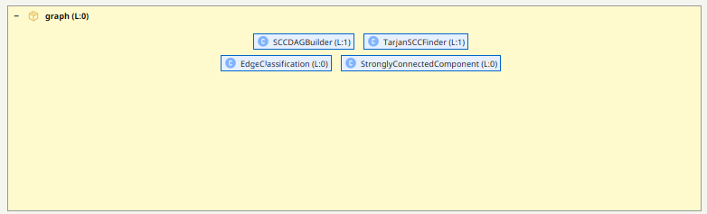
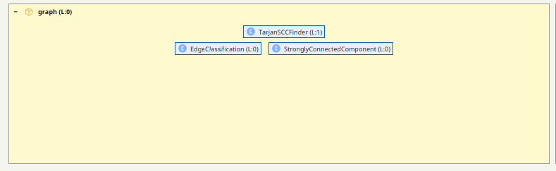
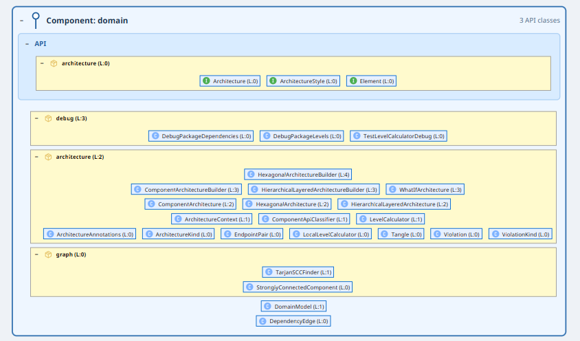
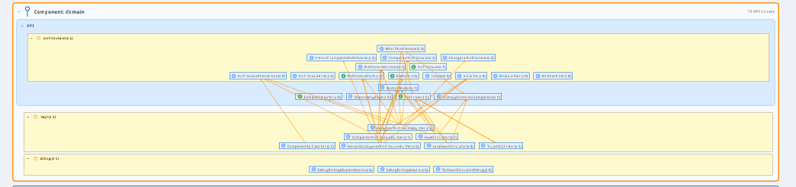
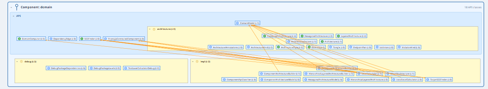
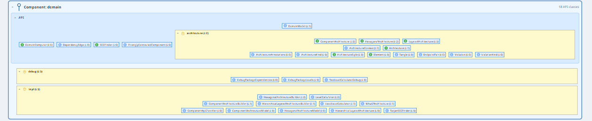
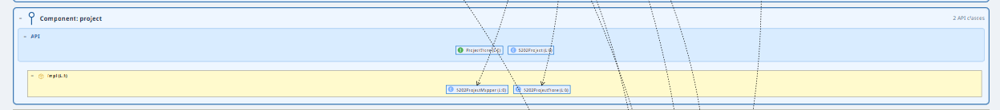
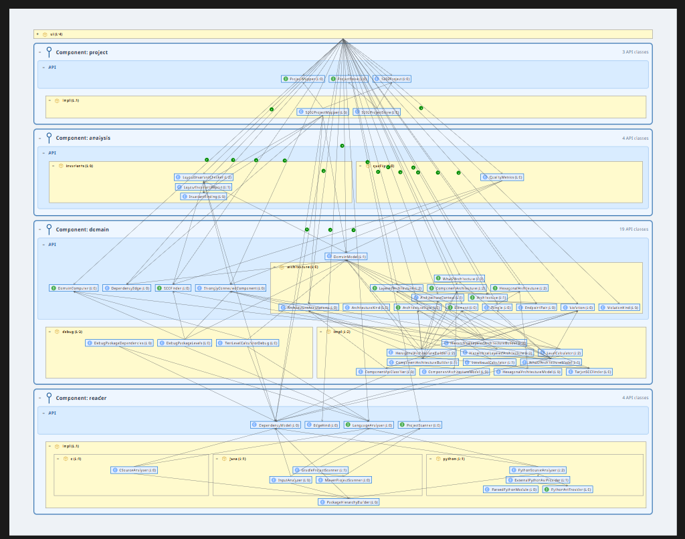

# The Tool That Fixed Itself

### An S202 Case Study in Architectural Self-Improvement

---

> **The short version:** We ran S202 on its own codebase.
> No source code was read. No grep. No IDE navigation.
> Only screenshots from the tool — and a to-do list that wrote itself.

---

## The Setup

S202 is a code analysis tool. It visualizes Java bytecode as layered architecture
diagrams, detects cycles, and shows component boundaries with their violations.

At some point the team asked the obvious question:

**What does S202 look like when you point it at S202?**

The answer turned out to be more interesting than expected. This document
is the unedited account of that experiment — every finding came from the
tool's visualization, every fix was guided by what the screenshots showed.

---

## Act I — The Inventory of Problems

We loaded the S202 JAR into S202 and switched to Component View.
The tool immediately suggested four component roots based on package structure.
Then we looked at the violation arrows.

There were a lot of them.


Every dashed line you see is a place where something reaches into another
component's implementation detail directly. The UI was basically calling
`new LevelCalculator()`, `new S202ProjectStore()`, `new TarjanSCCFinder()` —
everywhere. No interfaces in sight.

Before writing a single line of fix code, the tool had already written the
entire refactoring backlog:

| # | Finding | Verdict |
|---|---|---|
| 1 | `reader` — all implementations directly visible | Extract component API |
| 2 | `SCCVisualizationHelper` — zero callers | Delete |
| 3 | `SCCDAGBuilder` — only kept alive by its own test | Delete |
| 4 | `EdgeClassification` — wrong package, one caller elsewhere | Move |
| 5 | `graph` package — two classes left after cleanup | Dissolve into `domain` |
| 6 | `domain` — no API boundary at all | Cut component interface |
| 7 | `Architecture` hierarchy — `sealed` preventing extensibility | Open it up |
| 8 | `project` — three classes, all public, no interface | Add `ProjectStore` |

Zero lines of source code read. Every item on that list came from looking
at arrows in a diagram.

---

## Act II — Killing Dead Code

### Step 1 — The Reader Gets a Uniform

The `reader` package contained analyzers for Java, Python, and C.
All of them directly visible to the UI. Adding a new language meant
touching `S202Module`.

**Before:**


S202 showed the violation arrows immediately when we introduced a component
boundary: everything in `reader.java.*`, `reader.python.*`, `reader.c.*` was
being accessed directly from outside.


The fix: introduce `LanguageAnalyzer` as a proper interface, push all
concrete analyzers behind it, and wire them up through Avaje Inject's
service lookup so the registry doesn't need to know about any of them.

**Step 1 — after introducing interfaces** (still a cycle between API and impl):


The dashed arrows from impl back into the API gave it away: `AnalyzerRegistry`
was still knowing about concrete analyzers. Replaced it with Avaje Lookup —
and the cycle vanished.

**Step 2 — after removing AnalyzerRegistry:**


All incoming arrows point only at API classes. None go the other way.
The component boundary is clean.

---

### Steps 2–4 — The Graph Package Graveyard

The `graph` package had been accumulating technical debt.
S202 made the situation undeniable.

**`SCCVisualizationHelper`** — no incoming arrows at all:


Dead code. Deleted. No arguments.

After deletion the graph package shrank. S202 immediately showed
what was left:



**`SCCDAGBuilder`** — same story:


Its only caller was its own test, keeping it artificially alive. The functionality
had long since been absorbed into `LevelCalculator`. Deleted, along with the test.



**`EdgeClassification`** — alive, but in the wrong place:


The green arrow tells the story: its one and only caller sits in
`analysis.invariants`, not in `graph`. The class belonged there all along.
Moved. The `graph` package now contained exactly two things:


`TarjanSCCFinder` and `StronglyConnectedComponent`. A package with two classes
is not a package — it's a waiting room. Time to dissolve it.

---

## Act III — Cutting Component Boundaries

### Step 5 — The Graph Package Vanishes

`TarjanSCCFinder` and `StronglyConnectedComponent` moved into `domain`
with a proper API/impl split: `SCCFinder` as a public interface, `TarjanSCCFinder`
as the hidden implementation.



The `graph` package ceased to exist.

---

### Step 6 — Domain Gets Serious

This was the biggest step. `domain` had no component boundary at all.
The UI was instantiating `LevelCalculator`, all three architecture builders,
and everything in between — directly. Alles implizit API.

S202 had cut an automatic component boundary for us. The result was spectacular:


Every orange line is a `new SomeDomainImpl()` call from outside the component.
The two interfaces that already existed (`Architecture`, `ArchitectureStyle`)
were barely being used.

The fix: introduce `DomainComputer` to hide the calculators, push all builders
behind `ArchitectureStyle`, and move concrete implementations to `domain.impl`.

The result — almost clean, with one stubborn arrow remaining:


That one remaining line: `SCCFinder` had a `defaultFinder()` static method
that called `new TarjanSCCFinder()` directly. The API depended on the impl.
Classic. Removed the method and replaced all call sites with
`Lookup.lookup(SCCFinder.class)`. The cycle disappeared.

---

### Step 7 — The Architecture Hierarchy Gets Typed

The `Architecture` interface was `sealed` — every new architecture style
required touching every `switch` statement that handled it.

More importantly, each style has its own domain concepts:
- **Layered** has rows, levels, back-edges
- **Component** has API classification, bypass detection
- **Hexagonal** has rings, ports, adapter roles

These aren't variations of the same thing. They're different models.

**Before the refactoring** (concrete implementation classes mixed with API, violations):



The fix: proper sub-interfaces (`LayeredArchitecture`, `ComponentArchitecture`,
`HexagonalArchitecture`), concrete records renamed to `*Model` and moved to `domain.impl`.

**After introducing the typed interface hierarchy:**



The impl is hidden. But S202 still shows a small cycle — a `default` method in
`SCCFinder` was instantiating `TarjanSCCFinder` directly. The API layer
reached into impl. Replaced with Avaje Lookup.

**Final state — no cycles, no violations:**



---

### Step 8 — Project Gets an Interface

The `project` package was straightforward: three public classes, no boundary.


Added `ProjectStore` as interface, moved `S202ProjectStore` and `S202ProjectMapper`
to `project.impl`. Then went one step further: wired `S202Module` to use
`Lookup.lookup(ProjectStore.class)` instead of direct instantiation.



The dashed lines to the impl classes disappeared in the final Lookup wiring step.

---

## Act IV — The Final Score

After all fixes, we switched back to the component view and enabled
violation display. This is what S202 showed:


No violation arrows. Every component accessible only through its API.
Zero dashed lines crossing component boundaries.

And the full dependency view — all components, all inter-component dependencies,
all clean:



The arrows you see are legitimate: `ui` depends on `domain` API, `domain` depends
on `reader` API. Everything flows through interfaces. Nothing reaches into
implementation details.

---

## What Made This Possible

The entire analysis — from finding the problems to verifying the fixes —
was done by looking at screenshots. No grep. No "let me check the imports".
No "I think this class is used somewhere". Just: **what does the diagram show?**

This is what S202 is designed for. The architecture becomes a first-class
artifact that you can interrogate, measure, and fix — instead of something
that lives only in someone's head.

---

## Bonus — What We Built Along the Way

The process surfaced one missing feature: **how do you tell S202 which packages
are components and which aren't**, without relying on heuristics that sometimes
get it wrong?

The answer: a tiny annotation library — `s202-annotations`.

```xml
<dependency>
    <groupId>de.weigend</groupId>
    <artifactId>s202-annotations</artifactId>
    <version>1.0.0</version>
    <scope>provided</scope>
</dependency>
```

Three annotations, three `package-info.java` files:

```java
// This package IS a component root
@S202Component(displayName = "Payment")
package com.acme.payment;

// This sub-package is part of the component's PUBLIC API
@S202Api
package com.acme.payment.contract;

// This package should NEVER be auto-detected as a component
@S202Package
package com.acme.ui;
```

`@Retention(CLASS)` — no runtime overhead. S202 reads them from bytecode
during analysis. Your component topology is version-controlled, refactoring-proof,
and visible to every developer who opens `package-info.java`.

---

## The Numbers

| Metric | Before | After |
|---|---|---|
| Component violations | 61 | **0** |
| Dead classes found & deleted | — | **2** |
| Misplaced classes moved | — | **2** |
| Zombie packages dissolved | — | **1** (`graph`) |
| Public impl classes exposed | 22 | **0** |
| Lines of source code read to find all issues | — | **0** |

---

*S202 analyzed itself. Found real problems. Fixed them. Verified the fix.*
*Then it analyzed itself again. No violations.*

*That's the pitch.*

---

**→ [Back to README](../../README.md)**
**→ [Full technical notes](../exploration/S202_COMPONENT_DESIGN.md)**
